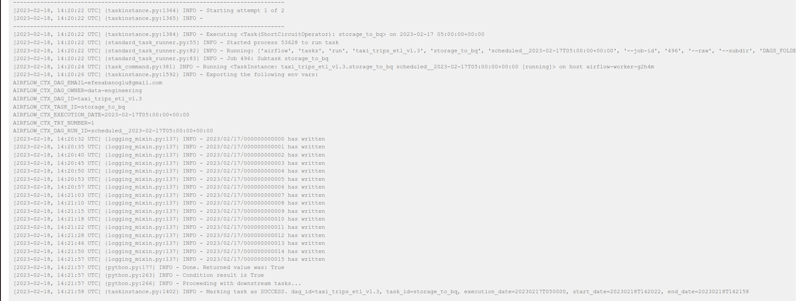
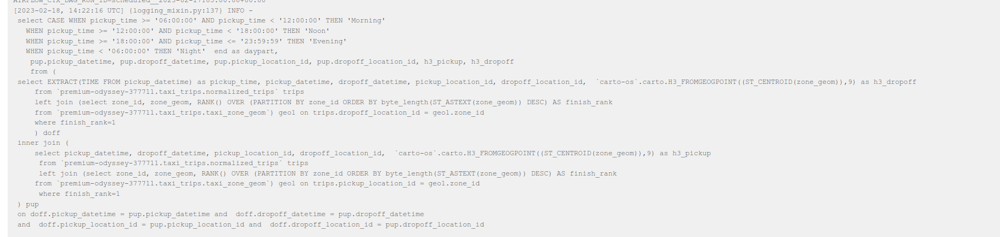

# taxi_trips_etl
### Etl process to find most common routes and hexagons of taxi trips.

#### Architecture Overview

#### Main service that used is airflow:

There is a airflow process which has 4 main steps:

 - storage_to_bq_task : Transferring data in storage to bigquery.
 - normalization_data : Clearing any erroneous data.
 - enrichment_data : step where hexagons and daypart are calculated using udf
 - final_result : step that prepares the stated results: 
   - What are the most popular pickup hexagons
   - What are the most popular dropoff hexagons
   - What are the most popular routes

#### First of all, writing a python function in preliminary work, extracting the data in year/month/day format we want from the public table to the **cloud storage**.
#### Cloud Storage

####  Then, in GCP, **a composer and a airflow** is put up and a daily running dag is put in it:

####  It is assumed that the data is uploaded daily to the year/month/day directory in **cloud storage**. Data with the desired prefix in this directory is transferred to a temporary table in **BigQuery**.
#### BQ Table

#### Airflow Step Logs

#### Then a normalization query is run on this table. In this query, rows that do not meet the following criteria are eliminated:
#### (the result is written to another temporary table and the previous temporary table is deleted.)
 - trip time should be bigger than 0.
 - passenger count should be bigger than 0.
 - trip distance should be bigger than 0.
 - mouse amount should be bigger than 0.

#### In this example we got rid of about 1000 rows.

#### Next, enriching the data begins. Here, the geological **polygon/multipolygon** states of the dropoff_id and pickup_ids are found with the help of the **taxi_zone_geom** table. Then the center of these polygons is found with the help of **ST_CENTROID** udf.
#### Finally, the hexagon value of these points is found with the help of **carto-os.carto.H3_FROMGEOGPOINT** udf. In addition, the **dayparts** are extracted according to the pickup_times and the main table with the new and qualified data is extracted together with these 2 last values. (the result is written to a historical table and the temporary table is deleted.)

#### An analysis query is run on this table to complete the project. This query contains the most popular routes, pick_up and drop_off hexagons. Then they are sorted by popularity and joined by popularity in order to show them all in a single table. As a result of this query, routes, pick_up and drop_off hexagons with equal popularity rankings in the data of that day are written to a historical table.

### Extras

#### In the daily running steps, the queries of that day are logged for easy debug.

### Cost Estimation

(1.26 MB * 1/1000 GB/MB * $0.020 * 30) Cloud Storage
 ### ≈0.009$ Cloud Storage

(11.41 MB * 1/ 1000000 TB/MB * 6$ * 30 ) 
 ### ≈0.002$ BigQuery

( 2.5 hours  * 1.5 vCPU ) * $0.045 per 1000 mCPU hours :
  ### ≈0.17$ - Cloud Composer Compute CPUs

( 2.5 hours * (1.875*2GiB) ) * $0.005 per GiB / hour: 
  ### ≈0.05$ - Cloud Composer Compute Memory

2.5 hours  / 740 total hours * 3.25 GiB * $0.17 per GiB / month :
 ### ≈0.002$ - Cloud Composer Database Storage

180hours *  (1+1) GiB ) * $0.0002 per GiB / hour: 
 ### ≈0.07$ - Cloud Composer Compute Storage

180 hours * $0.35 per hour:
 ### 63$ - Small Cloud Composer Environment Fee

 ### Cost = 63.3$